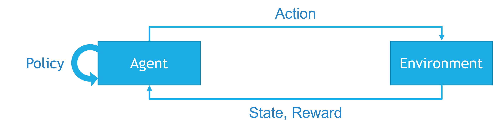

.. This document outlines the Chess AI Competition for AI Club

Chess AI Competition Overview
=============================

The Chess AI competition is focused around building an *agent* that uses algorithms in order to play the game of Chess. In this case, we will be using algorithms in order to create a model that understands what moves lead to good outcomes while playing Chess, and incentivize the model to take these actions.

Preface
-------

The work with this project falls under the larger scope of projects within Reinforcement Learning. In Reinforcement Learning, an agent (computer playing the game) is *rewarded* for taking actions that are good for itself, and *penalized* for taking actions that are bad for itself.

In this case, there are two primary areas that we can add code to create a Reinforcement Learning model. For us, we will specifically be focusing on the **reward function**, which defines what reward is returned to the agent, based on the actions it has taken in the environment.

The Competition
---------------

Your goal is to create a **reward function** based on the provided code, that gives an agent points for taking certain actions. With this in place, you can dictate the strategy of your Chess agent; if you give it more points for taking certain actions, it will take those actions. Combining this with known and proven Chess strategies, you can make an agent that can take down other AI models, and even other players.

**Over the course of a week (12/9/2021 - 12/15/2021)**, it is your task to design an agent that can play Chess as proficiently as possible. Once completed, you will submit the agent to the MSOE AI Club for a final competition, held during our W3 meeting on **12/16/2021, from 6-7 PM in DH110**.

How to Join
-----------

Anyone is welcome to, and encouraged to join this challenge. You *do not* need to be present at the challenge announcement meeting to participate. 

In order to join, please fill out the following form:

`Chess AI Sign-up Form`_

.. _Chess AI Sign-up Form: https://forms.office.com/Pages/ResponsePage.aspx?id=rM5GQNP9yUasgLfEpJurcIdJ5E0-M9ZFv56nqAPzJP5UNFRZS0lNTlA5MDhUNlNHUTA2UFdYRU5MWSQlQCN0PWcu

The Rules
---------

1. Your agent must follow the interface provided, acting as a derived (child) class from the provided **BaseAgent** class.
    a. While you need to follow the interface, this *does not* prevent you from overriding the methods within the base class. For instance, if you wish to use a more complex Policy function than the provided Minimax function, you can override those methods in your derived implementation. Following this interface ensures we can properly compete with your agent.
2. You must be able to run your agent using the provided *Engine* class, without changes. This is to ensure we can properly compete with your agent.
3. You may consult any online resources, or use any online code as long as it is cited properly.
4. A maximum of two people per team are allowed. You may work individually. Prizes will only be given to the members noted within the winning team's submitted Agent class.
5. Final submissions are due by **11:59 PM on Wednesday, 12/15/2021**. Late submissions are not allowed. 
6. The final competition will take place during the AI Club's W3 meeting on **12/16/2021, from 6-7 PM in DH110**.

The rules defined above are subject to change on any date throughout the competition. Annoncements of rule changes will be sent out on our `Slack Team`_. For questions or clarifications on the rules, please send a message in the *#competitions* channel on Slack.

.. _Slack Team: https://join.slack.com/t/msoe-ai/shared_invite/zt-8urzlp0z-8Qiekpin4WyGzMKtZAJuaQ

The Prizes
----------

One or both members on the winning team will win AI Club t-shirts, as well as 15 challenge tickets for the end of quarter raffle! These challenge tickets will put the winners up for first pick at prizes such as NVIDIA Jetsons, Raspberry Pis, gift cards, and/or other IoT/DIY kits at the end of the quarter.